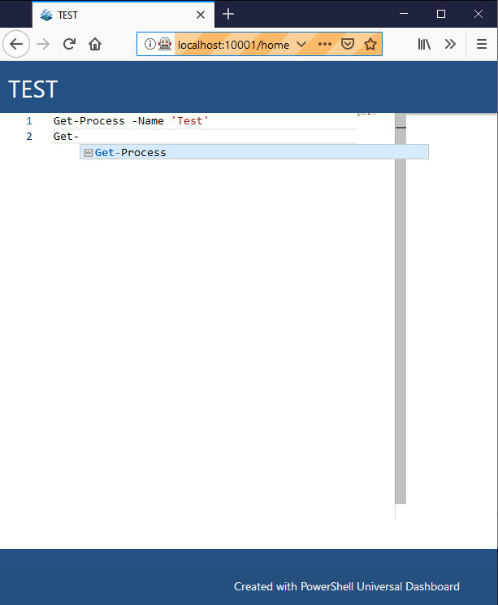
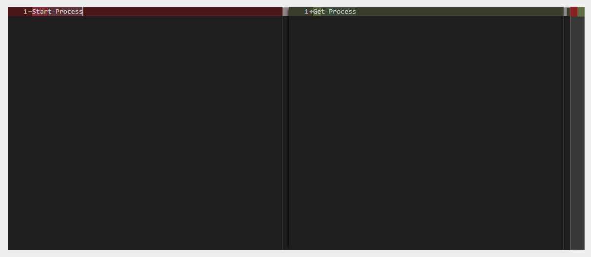

# Universal Dashboard Code Editor

Code editor control for [Universal Dashboard](https://github.com/ironmansoftware/universal-dashboard) based on [Monaco](https://microsoft.github.io/monaco-editor/).



# Installation

```
Install-Module UniversalDashboard.CodeEditor
```

# Examples 

## Creating an editor

```
New-UDCodeEditor -Language 'powershell' -Height '100ch' -Width '100ch' -Code 'Start-Process'
```

## Readonly Editor

```
New-UDCodeEditor -Language 'powershell' -Height '100ch' -Width '100ch' -Theme vs-dark -Code "Get-Process" -ReadOnly
```

## Adding Content

```
New-UDCodeEditor -Id 'editor' -Language 'powershell' -Height '100ch' -Width '100ch' -Theme vs-dark -Code "Get-Process" -ReadOnly
New-UDButton -Text 'Add Text' -OnClick {
    Add-UDElement -ParentId 'editor' -Content {
        'Get-Process'
    }
}
```

## Getting Content

```
New-UDCodeEditor -Id 'editor' -Language 'powershell' -Height '100ch' -Width '100ch' -Theme vs-dark
New-UDButton -Text "Get Text" -OnClick {
    Show-UDToast -Message (Get-UDElement -Id 'editor').Attributes["code"]
}
```

## Setting Content

```
New-UDCodeEditor -Id 'editor' -Language 'powershell' -Height '100ch' -Width '100ch' -Theme vs-dark
 New-UDButton -Text "Set Text" -OnClick {
    Set-UDElement -Id 'editor' -Attributes @{
        code = 'Get-Service'
    }
}
```

## Diff Support

```
New-UDCodeEditor -Id 'editor2' -Language 'powershell' -Theme vs-dark -Code "Get-Process" -ReadOnly -Height '500px' -Original 'Start-Process'
```

